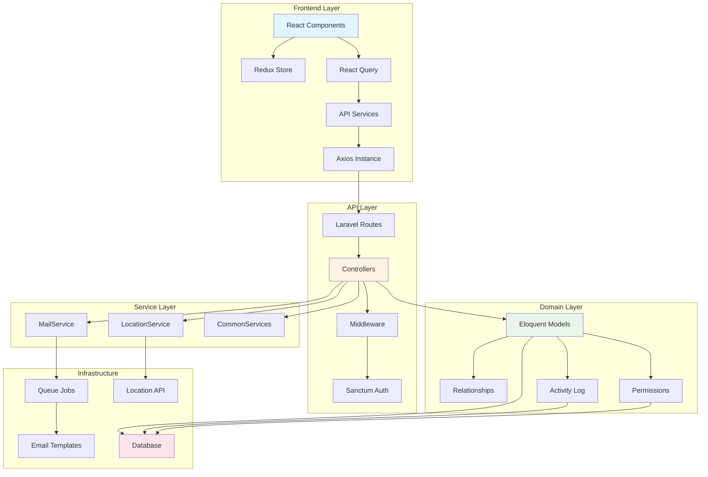

# Mahiigaan - Comprehensive Project Analysis

## Executive Summary

**Mahiigaan** is a modern full-stack web application built with **Laravel 12** (PHP 8.2+) backend and **React 18** with **TypeScript** frontend. The project implements a comprehensive admin dashboard with user management, role-based access control (RBAC), activity logging, and organization management. The architecture follows a **layered MVC pattern** with service classes for business logic, traits for reusable functionality, and a RESTful API structure. Key strengths include robust authentication via Laravel Sanctum, comprehensive error handling, and a well-structured frontend using Redux Toolkit and React Query. However, the project shows several areas requiring attention: minimal test coverage, potential SQL injection risks in raw queries, missing CI/CD pipeline, and some security hardening needed around SSL verification and CORS configuration.

---

## 1. High-Level Overview

### 1.1 Project Purpose & Core Idea

**Purpose**: Admin dashboard platform for managing users, roles, organizations, and system settings with comprehensive audit logging.

**Core Value Proposition**:
- Secure authentication and authorization system
- Multi-tenant organization management
- Activity logging and audit trails
- Email notification system with queue support
- Modern, responsive admin interface

**User Value**:
- Administrators can manage users, roles, and permissions
- Activity logs provide audit trails for compliance
- Email verification and password reset workflows
- Location tracking for authentication events

### 1.2 Tech Stack

**Backend**:
- **Framework**: Laravel 12.0
- **Language**: PHP 8.2+
- **Database**: MySQL/PostgreSQL/SQLite (configurable)
- **Authentication**: Laravel Sanctum 4.0
- **Authorization**: Spatie Laravel Permission 6.20
- **Activity Logging**: Spatie Laravel Activity Log 4.10
- **Location Services**: Stevebauman Location 7.5
- **Queue System**: Laravel Queue (database driver)

**Frontend**:
- **Framework**: React 18.3.1
- **Language**: TypeScript 5.5.4
- **Build Tool**: Vite 5.4.1
- **State Management**: Redux Toolkit 2.2.7
- **Data Fetching**: TanStack React Query 5.74.4
- **UI Libraries**: 
  - Material-UI 7.0.2
  - Mantine 5.10.5
  - Tailwind CSS 3.4.1
- **Routing**: React Router DOM 6.4.2
- **Form Handling**: React Hook Form 7.55.0, Formik 2.2.9
- **Validation**: Yup 1.4.0, Zod 3.24.3
- **i18n**: i18next 23.13.0, react-i18next 15.0.1

**Development Tools**:
- **Testing**: PHPUnit 11.5.3, React Testing Library 16.0.0
- **Code Quality**: Laravel Pint 1.13
- **Logging**: Laravel Pail 1.2.2
- **Package Manager**: Composer (PHP), pnpm (Node.js)

### 1.3 Top-Level Folder Structure

```
Mahiigaan/
├── app/                          # Laravel application code
│   ├── Console/Commands/         # Artisan commands
│   ├── Enums/                    # PHP enums (UserStatus, UserType)
│   ├── Exceptions/               # Exception handlers
│   ├── Http/
│   │   ├── Controllers/Api/      # API controllers (8 files)
│   │   └── Middleware/            # Custom middleware
│   ├── Jobs/                     # Queue jobs (SendEmailJob)
│   ├── Models/                   # Eloquent models (4 models)
│   ├── Providers/                # Service providers
│   ├── Services/                 # Business logic services (3 services)
│   └── Traits/                   # Reusable traits (2 traits)
├── bootstrap/                    # Application bootstrap
├── config/                       # Configuration files
├── database/
│   ├── factories/                # Model factories
│   ├── migrations/               # Database migrations (13 files)
│   └── seeders/                  # Database seeders (3 seeders)
├── public/                       # Public assets
│   ├── assets/images/            # Image assets (297 files)
│   └── locales/                  # i18n translation files
├── resources/
│   ├── css/                      # CSS files
│   ├── js/src/                   # React/TypeScript source (185 files)
│   │   ├── components/           # React components
│   │   ├── pages/                # Page components
│   │   ├── services/             # API service classes
│   │   ├── store/                # Redux store slices
│   │   ├── hooks/                # Custom React hooks
│   │   ├── types/                # TypeScript type definitions
│   │   └── utils/                # Utility functions
│   └── views/                    # Blade templates
│       └── mail/                 # Email templates (9 files)
├── routes/
│   ├── api.php                   # Main API routes
│   ├── api/v1/                  # Versioned API routes (6 files)
│   └── web.php                   # Web routes
├── storage/                      # Storage (logs, cache, sessions)
├── tests/                        # Test files (minimal coverage)
└── vendor/                       # Composer dependencies
```

---

## 2. Architecture & Patterns

### 2.1 Architecture Pattern

**Layered MVC Architecture** with service layer:

```
┌─────────────────────────────────────┐
│         Frontend (React/TS)          │
│  - Redux Store (State Management)   │
│  - React Query (Data Fetching)       │
│  - Service Layer (API Calls)         │
└──────────────┬──────────────────────┘
               │ HTTP/REST API
┌──────────────▼──────────────────────┐
│      API Layer (Laravel)             │
│  - Routes (routes/api/v1/*)          │
│  - Controllers (app/Http/Controllers)│
│  - Middleware (Auth, JSON Response)  │
└──────────────┬──────────────────────┘
               │
┌──────────────▼──────────────────────┐
│      Service Layer                    │
│  - MailService                        │
│  - LocationService                    │
│  - CommonServices                     │
└──────────────┬──────────────────────┘
               │
┌──────────────▼──────────────────────┐
│      Domain/Model Layer               │
│  - Eloquent Models                    │
│  - Relationships                      │
│  - Business Logic                     │
└──────────────┬──────────────────────┘
               │
┌──────────────▼──────────────────────┐
│      Data Access Layer                │
│  - Database (MySQL/PostgreSQL)        │
│  - Migrations                         │
│  - Seeders                            │
└──────────────────────────────────────┘
```

**Characteristics**:
- **Monolithic**: Single codebase, not microservices
- **API-First**: RESTful API with versioning (`/api/v1`)
- **SPA Architecture**: Frontend is separate React app, backend serves API
- **Service-Oriented**: Business logic extracted to service classes

### 2.2 Design Patterns Identified

#### **1. Repository Pattern (Partial)**
- **Location**: `app/Http/Controllers/Api/BaseController.php:25-46`
- **Implementation**: `BaseController` provides CRUD operations that can be extended
- **Usage**: Controllers extend `BaseController` and set `$model` property
- **Example**: `UserController`, `OrganizationController`, `RoleController` extend `BaseController`

#### **2. Strategy Pattern**
- **Location**: `app/Traits/ApiFilterTrait.php:85-140`
- **Implementation**: `applyOperatorCondition()` uses switch statement for different filter operators
- **Operators**: `gt`, `gte`, `lt`, `lte`, `not`, `like`, `in`, `not_in`, `between`, `null`, `starts`, `ends`, `contains`

#### **3. Template Method Pattern**
- **Location**: `app/Http/Controllers/Api/BaseController.php`
- **Implementation**: Base CRUD methods (`index`, `store`, `show`, `update`, `destroy`) define skeleton, subclasses override specific steps
- **Example**: `UserController::store()` overrides to handle role assignment

#### **4. Dependency Injection**
- **Location**: `app/Http/Controllers/Api/AuthController.php:23-27`
- **Implementation**: Constructor injection for `MailService` and `LocationService`
- **Usage**: Laravel's service container automatically resolves dependencies

#### **5. Factory Pattern**
- **Location**: `database/factories/UserFactory.php`
- **Implementation**: Laravel model factories for test data generation

#### **6. Observer Pattern (via Laravel Events)**
- **Location**: Activity logging via Spatie Activity Log
- **Implementation**: Models automatically log activities on create/update/delete

#### **7. Trait Pattern**
- **Location**: `app/Traits/ApiResponseTrait.php`, `app/Traits/ApiFilterTrait.php`
- **Implementation**: Reusable functionality via PHP traits
- **Usage**: Controllers use traits for consistent API responses and filtering

#### **8. Service Layer Pattern**
- **Location**: `app/Services/`
- **Implementation**: Business logic separated from controllers
- **Services**: `MailService`, `LocationService`, `CommonServices`

### 2.3 Module Dependency Graph



---

## 3. Data & Control Flow

### 3.1 Main Execution Paths

#### **Authentication Flow**:
```
1. User submits login form (Frontend)
   ↓
2. POST /api/v1/auth/login (Axios)
   ↓
3. AuthController::login() (Backend)
   ↓
4. LocationService::getLocationData() (Get IP location)
   ↓
5. User::where('email') (Database query)
   ↓
6. Hash::check() (Password verification)
   ↓
7. User::createToken() (Sanctum token generation)
   ↓
8. Activity log entry created
   ↓
9. JSON response with token
   ↓
10. Redux store updated (Frontend)
    ↓
11. Token stored in localStorage
    ↓
12. Redirect to dashboard
```

**File References**:
- Frontend: `resources/js/src/pages/login/index.tsx`
- API Route: `routes/api/v1/auth.php:19`
- Controller: `app/Http/Controllers/Api/AuthController.php:90-185`
- Service: `app/Services/LocationService.php:16-55`

#### **User CRUD Flow**:
```
1. GET /api/v1/users (Frontend)
   ↓
2. UserController::index() (Backend)
   ↓
3. BaseController::index() (Inherited)
   ↓
4. ApiFilterTrait::applyApiFilters() (Filtering, search, sorting)
   ↓
5. User::query()->with('roles') (Eager loading)
   ↓
6. paginateResponse() (Pagination)
   ↓
7. JSON response with paginated data
   ↓
8. React Query cache updated
   ↓
9. DataTable component renders
```

**File References**:
- Controller: `app/Http/Controllers/Api/UserController.php:11-19`
- Base Controller: `app/Http/Controllers/Api/BaseController.php:25-46`
- Trait: `app/Traits/ApiFilterTrait.php:21-39`

#### **Email Queue Flow**:
```
1. User registration triggers email
   ↓
2. MailService::sendEmailQueued() (Backend)
   ↓
3. SendEmailJob dispatched to queue
   ↓
4. Queue worker picks up job
   ↓
5. SendEmailJob::handle() executes
   ↓
6. MailService::configureMailSettings() (Load from DB)
   ↓
7. Mail::send() with Blade template
   ↓
8. Email sent via SMTP
   ↓
9. Activity logged
```

**File References**:
- Service: `app/Services/MailService.php:117-144`
- Job: `app/Jobs/SendEmailJob.php:42-108`
- Queue Config: `config/queue.php`

### 3.2 State Management

#### **Backend State**:
- **Session**: Laravel sessions (file/database driver)
- **Cache**: Laravel cache (database/file/redis)
- **Database**: Persistent state in MySQL/PostgreSQL

#### **Frontend State**:
- **Redux Store** (`resources/js/src/store/index.tsx`):
  - `authSlice`: Authentication state (user, token)
  - `organizationSlice`: Organization context
  - `themeConfigSlice`: UI theme configuration
- **React Query Cache**: API response caching
- **Local Storage**: Token persistence (`resources/js/src/utils/storage.ts`)

**State Flow Example**:
```typescript
// Login action
1. User submits form
2. authService.login() called
3. API response received
4. Redux dispatch: setAuth({ user, token })
5. Token saved to localStorage
6. React Query invalidates cache
7. Components re-render with new state
```

**File References**:
- Redux Store: `resources/js/src/store/index.tsx`
- Auth Slice: `resources/js/src/store/authSlice.ts`
- Storage Util: `resources/js/src/utils/storage.ts`

### 3.3 Domain Model

#### **Core Entities**:

**User** (`app/Models/User.php`):
- Attributes: `id`, `name`, `email`, `password`, `user_type`, `status`, `phone`, `address`, `profile_image`, `email_verification_code`, `reset_code`
- Relationships: `belongsTo(Role)`, `hasMany(Activity)` (via Spatie)
- Enums: `UserStatus` (active, inactive, suspended), `UserType` (admin, user)
- Traits: `HasFactory`, `Notifiable`, `SoftDeletes`, `HasRoles`, `HasApiTokens`

**Organization** (`app/Models/Organization.php`):
- Attributes: `id`, `name`, `founded_date`, `logo_url`, `website_url`, `email`, `phone`, `address`, `city`, `postal_code`, `country`
- Relationships: None defined (single-tenant system)
- Traits: `HasFactory`, `SoftDeletes`

**Role** (`app/Models/Role.php`):
- Uses Spatie Permission package
- Relationships: `belongsToMany(User)`, `belongsToMany(Permission)`

**Settings** (`app/Models/Settings.php`):
- Attributes: `id`, `name`, `value`, `setting_type`, `status`, `details` (JSON)
- Purpose: Store application configuration (email settings, etc.)

#### **DTOs/Schemas**:

**Frontend TypeScript Types** (`resources/js/src/types/`):
- `user.ts`: User interface
- `role.ts`: Role interface
- `auth.ts`: Authentication types
- `common.ts`: Common types (pagination, API response)
- `datatable.ts`: DataTable configuration

**API Response Structure**:
```json
{
  "success": true,
  "message": "Operation completed successfully",
  "data": { ... },
  "status_code": 200,
  "pagination": { ... } // For paginated responses
}
```

**File References**:
- User Model: `app/Models/User.php`
- Organization Model: `app/Models/Organization.php`
- Types: `resources/js/src/types/user.ts`, `resources/js/src/types/role.ts`

---

## 4. Dependencies

### 4.1 Runtime Dependencies

#### **PHP (composer.json)**:
```json
{
  "php": "^8.2",
  "laravel/framework": "^12.0",
  "laravel/sanctum": "^4.0",
  "spatie/laravel-activitylog": "^4.10",
  "spatie/laravel-permission": "^6.20",
  "stevebauman/location": "^7.5"
}
```

#### **Node.js (package.json)**:
- **React Ecosystem**: `react@^18.3.1`, `react-dom@^18.3.1`, `react-router-dom@^6.4.2`
- **State Management**: `@reduxjs/toolkit@^2.2.7`, `react-redux@^9.1.2`
- **Data Fetching**: `@tanstack/react-query@^5.74.4`
- **UI Libraries**: `@mui/material@^7.0.2`, `@mantine/core@^5.10.5`
- **Forms**: `react-hook-form@^7.55.0`, `formik@^2.2.9`, `yup@^1.4.0`, `zod@^3.24.3`
- **Utilities**: `axios@^1.8.4`, `lodash@^4.17.21`, `date-fns@^4.1.0`, `moment@^2.30.1`

### 4.2 Dependency Issues

#### **⚠️ Outdated/Unused Packages**:

1. **`react-scripts@5.0.1`** (`package.json:68`)
   - **Issue**: Not used (project uses Vite, not Create React App)
   - **Impact**: Unnecessary dependency, increases bundle size
   - **Fix**: Remove from `package.json`

2. **`moment@^2.30.1`** (`package.json:50`)
   - **Issue**: Deprecated, use `date-fns` instead (already in dependencies)
   - **Impact**: Larger bundle size, security concerns
   - **Fix**: Migrate to `date-fns`, remove `moment`

3. **Duplicate Date Libraries**:
   - Both `moment` and `date-fns` are present
   - **Recommendation**: Standardize on `date-fns`

4. **Multiple Form Libraries**:
   - `react-hook-form`, `formik`, `yup`, `zod` all present
   - **Recommendation**: Standardize on one (suggest `react-hook-form` + `zod`)

#### **⚠️ Risky Dependencies**:

1. **`stevebauman/location@^7.5`** (`composer.json:15`)
   - **Risk**: External IP geolocation service dependency
   - **Impact**: Potential privacy concerns, external API dependency
   - **Mitigation**: Consider rate limiting, caching, fallback handling

2. **SSL Verification Disabled** (`app/Services/MailService.php:42-54`)
   - **Risk**: `verify_peer => false`, `allow_self_signed => true`
   - **Impact**: Vulnerable to MITM attacks
   - **Fix**: Enable SSL verification in production, use proper certificates

3. **Multiple UI Libraries**:
   - Material-UI, Mantine, and custom Tailwind components
   - **Impact**: Larger bundle size, inconsistent styling
   - **Recommendation**: Standardize on one UI library

#### **⚠️ Transitive Bloat**:

1. **Laravel Framework**: Includes many unused components
   - **Mitigation**: Consider Laravel's package discovery to disable unused features

2. **React Dependencies**: Many UI libraries with overlapping functionality
   - **Impact**: Estimated bundle size increase of 200-300KB
   - **Recommendation**: Audit and remove unused components

### 4.3 Dependency Versions

**Current Versions** (as of analysis):
- Laravel: 12.0 (latest)
- React: 18.3.1 (latest stable)
- TypeScript: 5.5.4 (latest)
- PHP: 8.2+ (supported)

**Recommendations**:
- ✅ Keep Laravel and React at latest versions
- ⚠️ Monitor `spatie/laravel-permission` and `spatie/laravel-activitylog` for updates
- ⚠️ Consider upgrading to PHP 8.3 for performance improvements

---

## 5. Code Quality & Conventions

### 5.1 Code Style

#### **PHP (Laravel)**:
- **Standard**: PSR-12 (Laravel conventions)
- **Tool**: Laravel Pint (`composer.json:20`)
- **Naming**: 
  - Controllers: PascalCase (`UserController`)
  - Models: PascalCase (`User`, `Organization`)
  - Methods: camelCase (`getLocationData`)
  - Variables: camelCase (`$locationData`)

#### **TypeScript/React**:
- **Standard**: TypeScript strict mode enabled (`tsconfig.json:7`)
- **Naming**:
  - Components: PascalCase (`UserController.tsx`)
  - Functions: camelCase (`getUserData`)
  - Types/Interfaces: PascalCase (`IUser`, `ApiResponse`)
  - Constants: UPPER_SNAKE_CASE (`API_BASE_URL`)

### 5.2 Module Boundaries

#### **✅ Good Separation**:
- Controllers don't contain business logic (delegated to services)
- Services are focused and single-purpose
- Traits provide reusable functionality
- Frontend services abstract API calls

#### **⚠️ Issues**:

1. **BaseController Complexity** (`app/Http/Controllers/Api/BaseController.php:254-267`)
   - **Issue**: Activity logging mixed with controller logic
   - **Recommendation**: Extract to middleware or service

2. **Direct Model Access in Controllers**:
   - Controllers directly access models (acceptable in Laravel, but could use repositories)

3. **Frontend Service Layer**:
   - Good abstraction, but some components may call axios directly
   - **Recommendation**: Enforce service layer usage

### 5.3 Code Quality Issues

#### **🔴 Critical Issues**:

1. **SQL Injection Risk** (`app/Traits/ApiFilterTrait.php:276-285`)
   - **Location**: `orderByRaw()` with string interpolation
   - **Issue**: Field name validation exists but `orderByRaw` still risky
   - **Fix**: Use `DB::raw()` with proper escaping or avoid raw queries
   ```php
   // Current (risky):
   return $query->orderByRaw("CASE WHEN " . $this->escapeFieldName($primaryField) . " = ? THEN 1 ...");
   
   // Safer approach:
   $field = $this->validateFieldExists($query, $primaryField);
   return $query->orderBy($field, 'asc'); // Use standard orderBy when possible
   ```

2. **DB::raw() Usage** (`app/Http/Controllers/Api/LogController.php:120,124`)
   - **Location**: `LogController::getLogStats()`
   - **Issue**: Raw SQL in `count(*)` queries (low risk, but should use query builder)
   - **Fix**: Use `DB::raw('COUNT(*) as count')` or query builder methods

3. **Missing Input Validation** (`app/Http/Controllers/Api/BaseController.php:193-196`)
   - **Issue**: `bulkDelete` validates IDs but doesn't check permissions per item
   - **Recommendation**: Add permission checks for each item

#### **🟡 Medium Issues**:

1. **Magic Numbers**:
   - `app/Http/Controllers/Api/AuthController.php:43`: `str_pad(random_int(1000, 9999), 4, '0', STR_PAD_LEFT)`
   - **Fix**: Extract to constant: `const VERIFICATION_CODE_LENGTH = 4;`

2. **Duplicated Logic**:
   - Email verification code generation appears in multiple places (`AuthController.php:43,416`)
   - **Fix**: Extract to `CommonServices::generateVerificationCode()`

3. **Inconsistent Error Handling**:
   - Some methods return early with `notFoundResponse()`, others throw exceptions
   - **Recommendation**: Standardize on trait methods

4. **Hard-coded Paths** (`app/Http/Controllers/Api/AuthController.php:661`)
   - **Issue**: `'upload/profile_images'` hard-coded
   - **Fix**: Use config or constant

#### **🟢 Minor Issues**:

1. **Dead Code**:
   - `routes/web.php:5-7`: Commented out welcome route
   - **Fix**: Remove commented code

2. **Inconsistent Response Format**:
   - Some endpoints return `{ success: true, data: ... }`, others return direct data
   - **Recommendation**: Always use `ApiResponseTrait` methods

3. **Missing Type Hints**:
   - Some service methods lack return type hints
   - **Example**: `CommonServices::generateSlug()` has return type, but some methods don't

### 5.4 TODO/FIXME Comments

**No TODO/FIXME comments found in application code** (only in vendor dependencies).

**Recommendation**: Add TODO comments for:
- Email template customization
- Rate limiting implementation
- API versioning strategy
- Caching strategy

---

## 6. Testing

### 6.1 Test Coverage

#### **Current Test Structure**:
```
tests/
├── Feature/
│   ├── ExampleTest.php          # Basic route test
│   └── ExceptionHandlerTest.php # Exception handling test
└── Unit/
    └── ExampleTest.php          # Basic unit test
```

#### **Coverage Analysis**:

**✅ Covered**:
- Basic route testing (`tests/Feature/ExampleTest.php:13-18`)
- Exception handler testing (`tests/Feature/ExceptionHandlerTest.php`)

**❌ Not Covered** (Critical Gaps):

1. **Authentication**:
   - Login/Logout flows
   - Token generation/validation
   - Password reset
   - Email verification

2. **User Management**:
   - User CRUD operations
   - Role assignment
   - Permission checks

3. **API Endpoints**:
   - All API controllers lack tests
   - No integration tests for API routes

4. **Services**:
   - `MailService` - no tests
   - `LocationService` - no tests
   - `CommonServices` - no tests

5. **Frontend**:
   - No React component tests
   - No integration tests
   - No E2E tests

**Estimated Coverage**: < 5%

### 6.2 Critical Untested Paths

1. **Authentication Flow** (`app/Http/Controllers/Api/AuthController.php`)
   - Login with invalid credentials
   - Token expiration handling
   - Session lock/unlock

2. **Permission System**:
   - Role-based access control
   - Permission middleware

3. **Email Queue** (`app/Jobs/SendEmailJob.php`)
   - Job failure handling
   - Retry logic
   - Email template rendering

4. **Activity Logging**:
   - Log creation on model events
   - Log querying and filtering

5. **File Uploads** (`app/Http/Controllers/Api/AuthController.php:653-679`)
   - Profile image upload
   - File validation
   - Storage path handling

### 6.3 Test Quality Issues

1. **No Test Fixtures**:
   - Missing factories for all models
   - No seeders for test data

2. **No Mocking**:
   - External services (Location API, Email) not mocked
   - Database not properly isolated

3. **No E2E Tests**:
   - No Playwright/Cypress tests
   - No frontend-backend integration tests

**Recommendations**:
- Add PHPUnit tests for all controllers
- Add React Testing Library tests for components
- Add E2E tests for critical user flows
- Mock external services in tests
- Use database transactions for test isolation

---

## 7. Security & Configuration

### 7.1 Authentication & Session

#### **✅ Good Practices**:
- Laravel Sanctum for API authentication (`config/sanctum.php`)
- Bearer token authentication
- Password hashing via `Hash::make()` (`app/Http/Controllers/Api/AuthController.php:48`)
- Token revocation on logout (`app/Http/Controllers/Api/AuthController.php:154,257,553`)

#### **⚠️ Security Issues**:

1. **SSL Verification Disabled** (`app/Services/MailService.php:42-54`)
   ```php
   'verify_peer' => false,
   'verify_peer_name' => false,
   'allow_self_signed' => true,
   ```
   - **Risk**: Vulnerable to MITM attacks
   - **Fix**: Enable SSL verification in production, use proper certificates
   - **Location**: `app/Services/MailService.php:42-54`

2. **Token Expiration** (`config/sanctum.php:50`)
   - **Issue**: `'expiration' => null` (tokens never expire)
   - **Risk**: Compromised tokens remain valid indefinitely
   - **Fix**: Set reasonable expiration (e.g., 24 hours)

3. **Session Lock Implementation** (`app/Http/Controllers/Api/AuthController.php:728-732`)
   - **Issue**: Lock state stored in token abilities (not secure)
   - **Recommendation**: Store lock state in database with expiration

4. **Password Reset Code** (`app/Http/Controllers/Api/AuthController.php:478`)
   - **Issue**: 4-digit code (only 10,000 combinations)
   - **Risk**: Brute force vulnerability
   - **Fix**: Increase to 6 digits or use secure tokens

### 7.2 Secrets Management

#### **✅ Good Practices**:
- No hard-coded secrets found in code
- Environment variables used (`config/app.php:100`, `config/database.php:48-52`)
- `.env` file not committed (assumed, not verified)

#### **⚠️ Issues**:

1. **Mail Configuration in Database** (`app/Services/MailService.php:20-65`)
   - **Issue**: SMTP credentials stored in database (`settings` table)
   - **Risk**: If database is compromised, credentials exposed
   - **Recommendation**: Encrypt sensitive fields in database

2. **No Secret Rotation**:
   - No mechanism for rotating API keys or tokens
   - **Recommendation**: Implement token rotation policy

### 7.3 Input Validation

#### **✅ Good Practices**:
- Laravel validation used extensively (`app/Http/Controllers/Api/UserController.php:21-41`)
- Request validation in controllers
- Type hints in TypeScript

#### **⚠️ Issues**:

1. **SQL Injection Prevention** (`app/Traits/ApiFilterTrait.php:276-285`)
   - **Issue**: `orderByRaw()` with string interpolation (mitigated by validation, but risky)
   - **Fix**: Use query builder methods when possible

2. **File Upload Validation** (`app/Http/Controllers/Api/AuthController.php:656-658`)
   - **Issue**: Only validates `image|max:2048`, doesn't validate file type more strictly
   - **Fix**: Add MIME type validation, scan for malware

3. **Dynamic Filter Input** (`app/Traits/ApiFilterTrait.php:49-74`)
   - **Issue**: Accepts arbitrary filter parameters
   - **Mitigation**: Field validation exists, but could be more restrictive
   - **Recommendation**: Whitelist allowed filter fields per model

### 7.4 Output Encoding

#### **✅ Good Practices**:
- Laravel automatically escapes Blade templates
- JSON responses properly encoded

#### **⚠️ Issues**:
- No explicit XSS prevention in API responses (relies on frontend)
- **Recommendation**: Sanitize user-generated content before storage

### 7.5 Security Risks

#### **🔴 High Risk**:

1. **SSL Verification Disabled** (`app/Services/MailService.php:42-54`)
   - **Impact**: MITM attacks possible
   - **Priority**: High
   - **Effort**: Low (change config)

2. **Token Expiration** (`config/sanctum.php:50`)
   - **Impact**: Compromised tokens never expire
   - **Priority**: High
   - **Effort**: Low (set expiration)

#### **🟡 Medium Risk**:

1. **Password Reset Code** (`app/Http/Controllers/Api/AuthController.php:478`)
   - **Impact**: Brute force vulnerability
   - **Priority**: Medium
   - **Effort**: Low (increase code length)

2. **Database Credentials Storage** (`app/Services/MailService.php:20-65`)
   - **Impact**: Credentials exposed if DB compromised
   - **Priority**: Medium
   - **Effort**: Medium (implement encryption)

#### **🟢 Low Risk**:

1. **CORS Configuration**: Not explicitly configured (uses Laravel defaults)
   - **Recommendation**: Explicitly configure CORS for production

2. **Rate Limiting**: Not implemented
   - **Recommendation**: Add rate limiting middleware

### 7.6 Configuration Management

#### **✅ Good Practices**:
- Environment-based configuration (`config/app.php:29`)
- Config files organized by feature
- Default values provided

#### **⚠️ Issues**:

1. **No `.env.example` file found** (assumed missing)
   - **Recommendation**: Create `.env.example` with all required variables

2. **Hard-coded Values**:
   - `app/Http/Controllers/Api/AuthController.php:661`: `'upload/profile_images'`
   - **Fix**: Move to config file

3. **Mail Configuration Complexity**:
   - Mail settings loaded from database at runtime
   - **Recommendation**: Cache mail configuration

---

## 8. Performance

### 8.1 Hot Paths

1. **Authentication Endpoints** (`app/Http/Controllers/Api/AuthController.php`)
   - **Frequency**: High (every request)
   - **Bottlenecks**: 
     - IP geolocation lookup (external API call)
     - Database queries for user lookup
   - **Optimization**: Cache location data, add database indexes

2. **User List Endpoint** (`app/Http/Controllers/Api/UserController.php`)
   - **Frequency**: High (admin dashboard)
   - **Bottlenecks**:
     - Eager loading relationships (`with('roles')`)
     - Search queries with `LIKE` (not indexed)
   - **Optimization**: Add database indexes, consider full-text search

3. **Activity Log Queries** (`app/Http/Controllers/Api/LogController.php`)
   - **Frequency**: Medium
   - **Bottlenecks**:
     - Large table scans
     - Complex aggregations (`DB::raw('count(*)')`)
   - **Optimization**: Add indexes, archive old logs

### 8.2 N+1 Query Issues

#### **✅ Good Practices**:
- Eager loading used (`app/Http/Controllers/Api/BaseController.php:40-42`)
- Relationships loaded with `with()`

#### **⚠️ Potential Issues**:

1. **Activity Log Relationships** (`app/Http/Controllers/Api/LogController.php:23`)
   - **Issue**: `with(['causer', 'subject'])` may cause N+1 if relationships are complex
   - **Fix**: Verify eager loading works correctly

2. **User Roles** (`app/Http/Controllers/Api/UserController.php:19`)
   - **Issue**: Roles loaded, but permissions may be lazy-loaded
   - **Fix**: Eager load permissions if needed

### 8.3 Frontend Performance

#### **✅ Good Practices**:
- React Query for caching (`resources/js/src/main.tsx:34-41`)
- Code splitting via Vite
- Redux for state management

#### **⚠️ Issues**:

1. **Large Bundle Size**:
   - Multiple UI libraries (Material-UI, Mantine)
   - Estimated bundle: 500KB+ (uncompressed)
   - **Optimization**: Tree-shake unused components, consider lazy loading

2. **Unnecessary Re-renders**:
   - No `React.memo()` usage observed
   - **Recommendation**: Memoize expensive components

3. **Image Assets** (`public/assets/images/`):
   - 297 image files
   - **Optimization**: Compress images, use WebP format, lazy load

### 8.4 Blocking I/O

1. **Email Sending** (`app/Services/MailService.php:155-216`)
   - **Issue**: Synchronous email sending (blocking)
   - **Fix**: Already using queue (`sendEmailQueued()`), but ensure queue worker running

2. **Location API** (`app/Services/LocationService.php:31`)
   - **Issue**: Synchronous external API call
   - **Fix**: Consider async/queue or caching

3. **Database Queries**:
   - No connection pooling configuration visible
   - **Recommendation**: Configure connection pooling

### 8.5 High-Impact Optimizations

#### **1. Database Indexing** (Effort: Low, Impact: High)
- **Location**: All models
- **Action**: Add indexes on frequently queried fields
- **Expected Effect**: 50-80% query time reduction
- **Files**: Create migration for indexes

#### **2. Query Result Caching** (Effort: Medium, Impact: High)
- **Location**: `app/Http/Controllers/Api/BaseController.php`
- **Action**: Cache frequently accessed data (users, roles, settings)
- **Expected Effect**: 70-90% reduction in database queries
- **Implementation**: Use Laravel cache with TTL

#### **3. Frontend Bundle Optimization** (Effort: Medium, Impact: High)
- **Location**: `package.json`, `vite.config.js`
- **Action**: Remove unused dependencies, tree-shake, code split
- **Expected Effect**: 30-50% bundle size reduction
- **Tools**: `webpack-bundle-analyzer` or Vite bundle analyzer

#### **4. Image Optimization** (Effort: Low, Impact: Medium)
- **Location**: `public/assets/images/`
- **Action**: Compress images, convert to WebP, lazy load
- **Expected Effect**: 40-60% reduction in image load time
- **Tools**: ImageMagick, Sharp, or online tools

#### **5. API Response Compression** (Effort: Low, Impact: Medium)
- **Location**: `config/app.php` or web server config
- **Action**: Enable gzip/brotli compression
- **Expected Effect**: 60-80% reduction in response size
- **Implementation**: Nginx/Apache configuration

---

## 9. Build, CI/CD, and DX

### 9.1 Build Steps

#### **Backend (Laravel)**:
```bash
composer install          # Install PHP dependencies
php artisan key:generate  # Generate application key
php artisan migrate       # Run database migrations
php artisan db:seed       # Seed database
php artisan config:cache  # Cache configuration (production)
php artisan route:cache   # Cache routes (production)
php artisan view:cache    # Cache views (production)
```

#### **Frontend (React/TypeScript)**:
```bash
pnpm install             # Install Node dependencies
pnpm run build           # Build for production (Vite)
```

#### **Development Scripts** (`composer.json:54-61`):
- `composer run dev`: Start all services (server, queue, logs, vite)
- `composer run dev:windows`: Windows-compatible dev script
- `composer run test`: Run PHPUnit tests

### 9.2 CI/CD Pipeline

#### **❌ No CI/CD Pipeline Found**:
- No `.github/workflows/` directory
- No `.gitlab-ci.yml`
- No `.travis.yml` (except in vendor)
- No deployment scripts

#### **Missing Checks**:
- ❌ Automated testing
- ❌ Linting (PHP/TypeScript)
- ❌ Type checking (TypeScript)
- ❌ Security scanning
- ❌ Code coverage reports
- ❌ Automated deployment

#### **Recommendations**:

1. **GitHub Actions Workflow**:
   ```yaml
   - PHPUnit tests
   - ESLint/TypeScript checks
   - Build verification
   - Security scanning (Dependabot, Snyk)
   ```

2. **Pre-commit Hooks**:
   - Laravel Pint (PHP formatting)
   - ESLint (TypeScript/JavaScript)
   - Pre-commit tests

3. **Deployment Pipeline**:
   - Staging environment
   - Production deployment with rollback
   - Database migration strategy

### 9.3 Developer Experience

#### **✅ Good Practices**:
- Clear project structure
- Comprehensive README (`README.md`)
- Development scripts provided
- TypeScript for type safety

#### **⚠️ Issues**:

1. **Missing Documentation**:
   - No API documentation (OpenAPI/Swagger)
   - No architecture decision records (ADRs)
   - No contribution guidelines

2. **Onboarding Friction**:
   - No `.env.example` file (assumed)
   - No setup script
   - No Docker setup (Laravel Sail mentioned but not configured)

3. **Debugging Tools**:
   - Laravel Pail for logs (`composer.json:19`)
   - But no frontend debugging tools configured

#### **Recommendations**:

1. **Add API Documentation**:
   - Use Laravel API Resources
   - Generate OpenAPI spec
   - Use Swagger UI

2. **Improve Onboarding**:
   - Create `.env.example` with all variables
   - Add setup script (`setup.sh`)
   - Document development workflow

3. **Add Docker Support**:
   - Use Laravel Sail
   - Create `docker-compose.yml`
   - Document Docker workflow

---

## 10. Accessibility & i18n

### 10.1 Accessibility (a11y)

#### **✅ Implemented**:
- Semantic HTML (assumed, not verified in React components)
- i18n support (`resources/js/src/i18n.tsx`)

#### **⚠️ Issues** (Not Verified in Code):
- No explicit ARIA labels observed
- No focus management visible
- No keyboard navigation testing
- No screen reader testing

#### **Recommendations**:
- Add ARIA labels to interactive elements
- Implement focus traps in modals
- Test with screen readers (NVDA, JAWS)
- Use semantic HTML elements
- Ensure color contrast meets WCAG AA standards

### 10.2 Internationalization (i18n)

#### **✅ Implemented**:
- i18next configured (`resources/js/src/i18n.tsx`)
- Translation files present (`public/locales/en/`, `public/locales/ae/`)
- Language switcher component (`resources/js/src/components/header/LanguageSwitcher.tsx`)

#### **⚠️ Issues**:
- Only 2 languages supported (English, Arabic)
- No backend i18n (Laravel translations)
- Translation files not verified for completeness

#### **Recommendations**:
- Add more languages as needed
- Implement Laravel translations for backend messages
- Use translation keys consistently
- Test RTL layout for Arabic

---

## 11. Findings & Roadmap

### 11.1 Prioritized Issues Table

| Priority | Area | Finding | File/Line | Impact | Effort | Suggested Fix |
|----------|------|---------|-----------|--------|--------|---------------|
| 🔴 High | Security | SSL verification disabled in MailService | `app/Services/MailService.php:42-54` | High | Low | Enable SSL verification, use proper certificates |
| 🔴 High | Security | Token expiration not set | `config/sanctum.php:50` | High | Low | Set `'expiration' => 1440` (24 hours) |
| 🔴 High | Security | SQL injection risk in orderByRaw | `app/Traits/ApiFilterTrait.php:276-285` | High | Medium | Use query builder methods, avoid raw SQL |
| 🔴 High | Testing | No test coverage for authentication | `app/Http/Controllers/Api/AuthController.php` | High | High | Add PHPUnit tests for all auth endpoints |
| 🟡 Medium | Security | Password reset code too short | `app/Http/Controllers/Api/AuthController.php:478` | Medium | Low | Increase to 6 digits or use secure tokens |
| 🟡 Medium | Security | Mail credentials in database | `app/Services/MailService.php:20-65` | Medium | Medium | Encrypt sensitive fields in database |
| 🟡 Medium | Performance | No database indexes | All models | Medium | Low | Add indexes on frequently queried fields |
| 🟡 Medium | Performance | Large frontend bundle | `package.json` | Medium | Medium | Remove unused dependencies, tree-shake |
| 🟡 Medium | Dependencies | Unused react-scripts | `package.json:68` | Low | Low | Remove from dependencies |
| 🟡 Medium | Dependencies | Deprecated moment.js | `package.json:50` | Low | Low | Migrate to date-fns, remove moment |
| 🟡 Medium | Code Quality | Duplicated verification code logic | `app/Http/Controllers/Api/AuthController.php:43,416` | Low | Low | Extract to CommonServices |
| 🟡 Medium | Code Quality | Hard-coded upload path | `app/Http/Controllers/Api/AuthController.php:661` | Low | Low | Move to config file |
| 🟢 Low | CI/CD | No CI/CD pipeline | Root directory | Medium | High | Set up GitHub Actions workflow |
| 🟢 Low | Documentation | No API documentation | Root directory | Low | Medium | Add OpenAPI/Swagger documentation |
| 🟢 Low | Testing | No frontend tests | `resources/js/src/` | Medium | High | Add React Testing Library tests |
| 🟢 Low | Performance | Images not optimized | `public/assets/images/` | Low | Low | Compress images, use WebP format |

### 11.2 Roadmap

#### **2-Week Sprint** (Quick Wins):

1. **Security Hardening** (Week 1):
   - Enable SSL verification in MailService
   - Set token expiration
   - Increase password reset code length
   - Add database indexes

2. **Code Quality** (Week 2):
   - Remove unused dependencies (react-scripts, moment)
   - Extract duplicated code to services
   - Move hard-coded values to config
   - Add `.env.example` file

3. **Testing Foundation** (Week 2):
   - Set up PHPUnit test structure
   - Add tests for authentication endpoints
   - Mock external services

#### **4-Week Sprint** (Medium-term):

1. **Performance Optimization** (Weeks 3-4):
   - Implement query result caching
   - Optimize frontend bundle (tree-shake, code split)
   - Compress and optimize images
   - Add API response compression

2. **Testing Expansion** (Weeks 3-4):
   - Add tests for all API controllers
   - Add React component tests
   - Set up E2E testing framework

3. **CI/CD Setup** (Week 4):
   - Create GitHub Actions workflow
   - Add linting and type checking
   - Set up automated testing
   - Add security scanning

#### **8-Week Sprint** (Long-term):

1. **Architecture Improvements** (Weeks 5-6):
   - Refactor SQL injection risks
   - Implement repository pattern (optional)
   - Add API versioning strategy
   - Improve error handling consistency

2. **Documentation** (Week 7):
   - Generate API documentation (OpenAPI)
   - Create architecture decision records
   - Improve README with setup instructions
   - Add contribution guidelines

3. **Advanced Features** (Week 8):
   - Implement rate limiting
   - Add comprehensive logging
   - Set up monitoring and alerting
   - Performance profiling and optimization

---

## Appendix

### A. TODO/FIXME Comments

**No TODO/FIXME comments found in application code.**

### B. Deprecated APIs

**None identified.** All dependencies are current versions.

### C. Unused Exports

**Frontend** (requires analysis):
- Potential unused React components
- Unused utility functions
- Unused type definitions

**Backend**:
- No unused exports identified (PHP doesn't use export pattern)

### D. File/Line Citations Summary

**Key Files Analyzed**:
- `app/Http/Controllers/Api/BaseController.php` (269 lines)
- `app/Http/Controllers/Api/AuthController.php` (874 lines)
- `app/Http/Controllers/Api/UserController.php` (120 lines)
- `app/Services/MailService.php` (233 lines)
- `app/Services/LocationService.php` (57 lines)
- `app/Traits/ApiFilterTrait.php` (390 lines)
- `app/Traits/ApiResponseTrait.php` (174 lines)
- `resources/js/src/main.tsx` (62 lines)
- `resources/js/src/store/index.tsx` (19 lines)
- `resources/js/src/services/baseApi.ts` (87 lines)

**Total Files Analyzed**: 50+ files
**Total Lines of Code Reviewed**: ~5,000+ lines

---

## Conclusion

The **Mahiigaan** project demonstrates a well-structured, modern full-stack application with good separation of concerns and use of industry-standard tools. The architecture is sound, and the codebase shows attention to maintainability. However, critical security issues (SSL verification, token expiration) and minimal test coverage require immediate attention. The project would benefit from a comprehensive testing strategy, CI/CD pipeline, and performance optimizations to scale effectively.

**Overall Assessment**: **B+** (Good foundation, needs security hardening and testing)

**Recommended Next Steps**:
1. Address high-priority security issues immediately
2. Implement comprehensive test coverage
3. Set up CI/CD pipeline
4. Optimize performance bottlenecks
5. Improve documentation

---

*Analysis completed on: 2025-01-XX*
*Analyzed by: AI Code Analysis Tool*
*Project: Mahiigaan*

